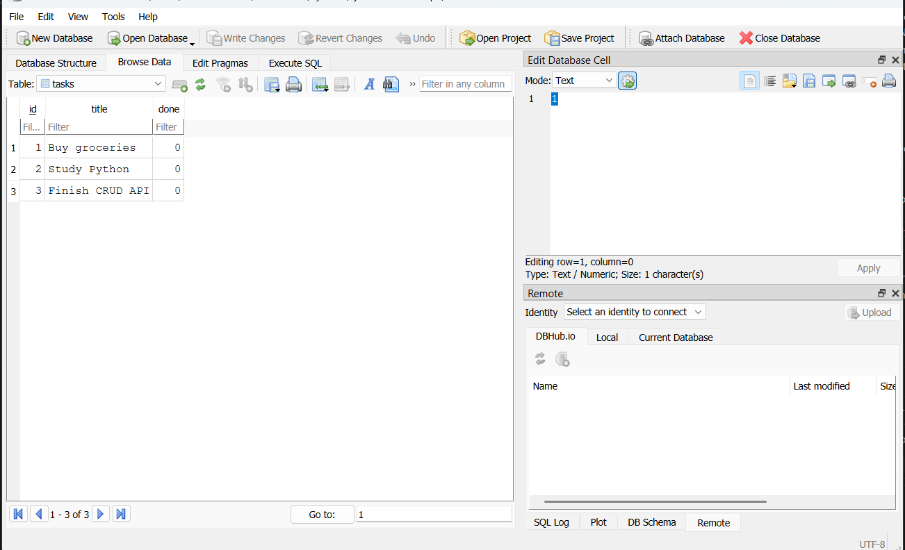

# TaskAPI

TaskAPI is a simple CRUD API built with Python, FastAPI, and SQLite.

The project started as an in-memory CRUD API and was updated to use a real SQLite database for persistent data storage.

## Features

- Create tasks
- Read all tasks
- Read a single task
- Update tasks
- Delete tasks
- Validate task titles
- Return appropriate HTTP status codes
- Store tasks in a SQLite database
- Automatically create the database and table
- Automatically insert three example tasks when the table is empty
- Persist data between server restarts

## Technologies

- Python
- FastAPI
- Uvicorn
- SQLite
- Pydantic
- DB Browser for SQLite

## Project Structure

```text
flyrank-w2-crud-api/
├── main.py
├── database.py
├── tasks.db
├── README.md
├── .gitignore
└── venv/
```

### File Breakdown

| File | Description |
| --- | --- |
| `main.py` | Contains the FastAPI application and CRUD endpoints. |
| `database.py` | Handles the SQLite connection, table creation, and initial example data. |
| `tasks.db` | The SQLite database file where tasks are stored. |
| `README.md` | Project documentation. |
| `venv/` | Python virtual environment used for the project. It should not be committed to GitHub. |

## Database

This project uses SQLite instead of an in-memory Python list. SQLite is lightweight, does not require a separate database server, and stores the database in a single file, `tasks.db`.

The application automatically creates the database and the `tasks` table if they do not exist. Three example tasks are inserted only when the table is empty.

### Tasks Table Schema

| Column | Type | Description |
| --- | --- | --- |
| `id` | `INTEGER` | Unique identifier for each task. |
| `title` | `TEXT` | Task title. |
| `done` | `BOOLEAN` | Indicates whether the task is completed. |

## API Endpoints

| Method | Endpoint | Description |
| --- | --- | --- |
| `GET` | `/` | Returns API information. |
| `GET` | `/health` | Checks API health. |
| `GET` | `/tasks` | Returns all tasks. |
| `GET` | `/tasks/{task_id}` | Returns one task. |
| `POST` | `/tasks` | Creates a new task. |
| `PUT` | `/tasks/{task_id}` | Updates a task. |
| `DELETE` | `/tasks/{task_id}` | Deletes a task. |

## Running the Project

1. Clone the repository:

   ```bash
   git clone <your-repository-url>
   ```

2. Navigate to the project:

   ```bash
   cd flyrank-w2-crud-api
   ```

3. Create a virtual environment:

   ```bash
   python -m venv venv
   ```

4. Activate the virtual environment.

   **Windows PowerShell**

   ```powershell
   .\venv\Scripts\Activate.ps1
   ```

   **Windows Command Prompt**

   ```cmd
   venv\Scripts\activate
   ```

5. Install the required packages:

   ```bash
   pip install -r requirements.txt
   ```

6. Start the FastAPI server:

   ```bash
   uvicorn main:app --reload
   ```

The API will be available at <http://127.0.0.1:8000>.

## Swagger UI

FastAPI automatically provides interactive API documentation at <http://127.0.0.1:8000/docs>.

Use Swagger UI to test all CRUD endpoints interactively.

## Example Requests

### Create a Task

`POST /tasks`

Request body:

```json
{
  "title": "Buy milk"
}
```

Successful response (`201 Created`):

```json
{
  "id": 4,
  "title": "Buy milk",
  "done": false
}
```

### Get All Tasks

`GET /tasks`

Example response (`200 OK`):

```json
[
  {
    "id": 1,
    "title": "Buy groceries",
    "done": false
  },
  {
    "id": 2,
    "title": "Study Python",
    "done": false
  },
  {
    "id": 3,
    "title": "Finish CRUD API",
    "done": false
  }
]
```

### Update a Task

`PUT /tasks/1`

Request body:

```json
{
  "title": "Buy groceries and milk",
  "done": true
}
```

### Delete a Task

`DELETE /tasks/1`

Successful response: `204 No Content`

## Validation and Error Handling

The API validates task titles. An empty title returns `400 Bad Request`.

Example request:

```json
{
  "title": "   "
}
```

Response:

```json
{
  "detail": "Title cannot be empty"
}
```

Requesting a task ID that does not exist returns `404 Not Found`.

Example: `GET /tasks/999`

```json
{
  "detail": "Task 999 not found"
}
```

## SQL Queries Explored

DB Browser for SQLite was used to inspect and modify the database manually.

### 1. List Every Task

```sql
SELECT * FROM tasks;
```

### 2. Show Completed Tasks

```sql
SELECT * FROM tasks WHERE done = 1;
```

### 3. Count All Tasks

```sql
SELECT COUNT(*) FROM tasks;
```

### 4. Mark Every Task as Completed

```sql
UPDATE tasks SET done = 1;
```

### 5. Delete All Completed Tasks

```sql
DELETE FROM tasks WHERE done = 1;
```

The changes made directly to SQLite were verified through the FastAPI Swagger UI.

## Database Screenshot

The SQLite database was opened and inspected using DB Browser for SQLite.



## Persistence

The original CRUD API stored tasks in an in-memory Python list, so tasks were lost whenever the server restarted. The project now uses SQLite for persistent storage.

```text
Client
  |
FastAPI
  |
SQLite
  |
tasks.db
```

Because tasks are stored in `tasks.db`, they remain available after the FastAPI server is restarted.

## Database Initialization

When the application starts:

1. The SQLite database is created if it does not exist.
2. The `tasks` table is created if it does not exist.
3. The application checks whether the `tasks` table is empty.
4. Three example tasks are inserted only when the table is empty.

This prevents the example tasks from being duplicated every time the application starts.

## Learning Outcome

This project demonstrates the separation between the API layer and the data layer. The API endpoints remain the same even though the storage implementation changed from an in-memory list to a SQLite database.

The client still uses:

- `GET /tasks`
- `POST /tasks`
- `PUT /tasks/{id}`
- `DELETE /tasks/{id}`

The main difference is that the data is now stored persistently in a real database.

## Assignment Checklist

- [x] SQLite database created
- [x] `tasks` table created automatically
- [x] Three example tasks inserted only when the table is empty
- [x] `GET` endpoints connected to SQLite
- [x] `POST` endpoint connected to SQLite
- [x] `PUT` endpoint connected to SQLite
- [x] `DELETE` endpoint connected to SQLite
- [x] Data survives server restarts
- [x] Unknown IDs return `404`
- [x] Invalid titles return `400`
- [x] SQL queries explored using DB Browser for SQLite
- [x] Database changes verified through the API
- [x] Database screenshot added
- [x] README updated