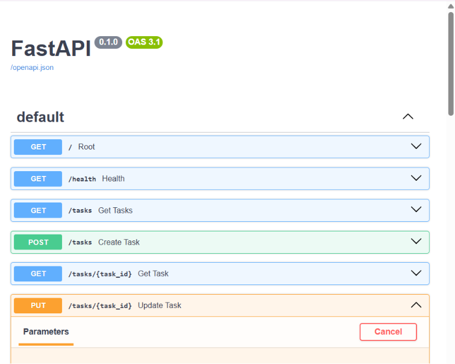

# Task API

## Description

A simple RESTful CRUD API for managing a to-do list,
built using Python and FastAPI.

## Technologies

- Python 3.10+
- FastAPI
- Uvicorn
- Pydantic

## Installation

### 1. Clone the repository

git clone [REPOSITORY_URL](https://github.com/callMeJZ/Flyrank-crud-api.git)

### 2. Enter the directory

cd Flyrank-crud-api

### 3. Create virtual environment

python -m venv venv

### 4. Activate virtual environment

venv\Scripts\activate

### 5. Install dependencies

pip install -r requirements.txt

### 6. Run the server

uvicorn main:app --reload

## API

| Method | Endpoint | Description |
|--------|----------|-------------|
| GET | / | API information |
| GET | /health | Health check |
| GET | /tasks | Get all tasks |
| GET | /tasks/{id} | Get one task |
| POST | /tasks | Create task |
| PUT | /tasks/{id} | Update task |
| DELETE | /tasks/{id} | Delete task |

## Swagger UI

Open:

http://localhost:8000/docs

## Example curl

curl -X 'PUT' \
  'http://localhost:8000/tasks/2' \
  -H 'accept: application/json' \
  -H 'Content-Type: application/json' \
  -d '{
  "title": "string",
  "done": true
}'