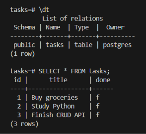

# TaskAPI

TaskAPI is a simple CRUD API built with Python, FastAPI, and PostgreSQL.

The project started as an in-memory CRUD API, was first updated to use SQLite for persistent storage, and was then migrated to PostgreSQL running in Docker. The current version uses Docker Compose to run both the FastAPI application and PostgreSQL database as a single stack.

## Features

- Create, read, update, and delete tasks
- Validate task titles
- Return appropriate HTTP status codes
- Store tasks in PostgreSQL
- Automatically create the `tasks` table
- Automatically seed three example tasks when the table is empty
- Persist PostgreSQL data using a Docker volume
- Run the API and database using Docker Compose
- Provide interactive API documentation through Swagger UI

## Technologies

- Python 3.13
- FastAPI
- Uvicorn
- PostgreSQL 17
- Psycopg
- Pydantic
- Docker
- Docker Compose

## Project Structure

```text
flyrank-w2-crud-api/
├── main.py
├── database.py
├── requirements.txt
├── Dockerfile
├── docker-compose.yml
├── .env.example
├── .gitignore
├── README.md
└── docker-evidence.png
```

| File | Description |
| --- | --- |
| `main.py` | FastAPI application and CRUD endpoints. |
| `database.py` | PostgreSQL connection, table creation, and seed data. |
| `requirements.txt` | Python dependencies. |
| `Dockerfile` | Instructions for building the API image. |
| `docker-compose.yml` | Defines the API and PostgreSQL services. |
| `.env.example` | Example environment variables required by the stack. |
| `.gitignore` | Excludes `.env`, virtual environments, and other local files. |
| `docker-evidence.png` | PostgreSQL `psql` evidence screenshot. |
| `README.md` | Project documentation. |

## PostgreSQL Database

The current version uses PostgreSQL instead of SQLite. PostgreSQL runs in the `taskdb` Docker container and uses the `tasks` database.

The application connects through the `DATABASE_URL` environment variable.

### Tasks Table

The application automatically creates the `tasks` table when it starts:

```sql
CREATE TABLE IF NOT EXISTS tasks (
    id SERIAL PRIMARY KEY,
    title TEXT NOT NULL,
    done BOOLEAN NOT NULL
);
```

| Column | Type | Description |
| --- | --- | --- |
| `id` | `SERIAL` | Unique task identifier. |
| `title` | `TEXT` | Task title. |
| `done` | `BOOLEAN` | Whether the task is completed. |

When the table is empty, the application inserts:

```text
Buy groceries
Study Python
Finish CRUD API
```

## Docker Compose

Docker Compose runs the complete stack:

```text
                 Docker Compose
                       |
              +--------+--------+
              |                 |
              v                 v
       FastAPI API        PostgreSQL
     taskapi-container       taskdb
              |                 |
              +--------+--------+
                       |
                 Docker network
```

The API uses the Compose database service name `db` rather than `localhost` when connecting to PostgreSQL from inside the API container.

## Environment Variables

Copy `.env.example` to `.env` before starting the stack.

Windows PowerShell:

```powershell
Copy-Item .env.example .env
```

Linux/macOS:

```bash
cp .env.example .env
```

The example file contains:

```env
POSTGRES_PASSWORD=dev
POSTGRES_DB=tasks
DATABASE_URL=postgresql://postgres:dev@db:5432/tasks
```

| Variable | Description |
| --- | --- |
| `POSTGRES_PASSWORD` | Password used by PostgreSQL. |
| `POSTGRES_DB` | PostgreSQL database name. |
| `DATABASE_URL` | Connection string used by FastAPI. |

The real `.env` file is ignored by Git and must not be committed.

## Running the Project

### 1. Clone the repository

```bash
git clone <your-repository-url>
```

### 2. Enter the project directory

```bash
cd flyrank-w2-crud-api
```

### 3. Create `.env`

Windows PowerShell:

```powershell
Copy-Item .env.example .env
```

Linux/macOS:

```bash
cp .env.example .env
```

### 4. Start everything

```bash
docker compose up
```

If the API image needs to be rebuilt:

```bash
docker compose up --build
```

Docker Compose creates the network and volume, starts PostgreSQL, waits for the database health check, and starts the FastAPI application.

**No manual database or table setup is required.**

## API

API base URL:

```text
http://localhost:8000
```

Swagger UI:

```text
http://localhost:8000/docs
```

## API Endpoints

| Method | Endpoint | Description |
| --- | --- | --- |
| `GET` | `/` | Returns API information. |
| `GET` | `/health` | Checks API health. |
| `GET` | `/tasks` | Returns all tasks. |
| `GET` | `/tasks/{task_id}` | Returns one task. |
| `POST` | `/tasks` | Creates a new task. |
| `PUT` | `/tasks/{task_id}` | Updates a task. |
| `DELETE` | `/tasks/{task_id}` | Deletes a task. |

## Example Requests

### Create a Task

`POST /tasks`

```json
{
  "title": "Buy milk"
}
```

Example response:

```json
{
  "id": 4,
  "title": "Buy milk",
  "done": false
}
```

### Get All Tasks

`GET /tasks`

```json
[
  {
    "id": 1,
    "title": "Buy groceries",
    "done": false
  },
  {
    "id": 2,
    "title": "Study Python",
    "done": false
  },
  {
    "id": 3,
    "title": "Finish CRUD API",
    "done": false
  }
]
```

### Update a Task

`PUT /tasks/1`

```json
{
  "title": "Buy groceries and milk",
  "done": true
}
```

### Delete a Task

`DELETE /tasks/1`

Successful response:

```text
204 No Content
```

## Validation and Error Handling

An empty or whitespace-only title returns `400 Bad Request`.

```json
{
  "title": "   "
}
```

Response:

```json
{
  "detail": "Title cannot be empty"
}
```

A task ID that does not exist returns `404 Not Found`.

Example:

```text
GET /tasks/999
```

Response:

```json
{
  "detail": "Task 999 not found"
}
```

## API Test Evidence

The running Docker Compose stack was tested with:

```bash
curl -i http://localhost:8000/tasks
```

Actual response:

```text
HTTP/1.1 200 OK
date: Sun, 30 Aug 2026 18:03:28 GMT
server: uvicorn
content-length: 140
content-type: application/json

[{"id":1,"title":"Buy groceries","done":false},{"id":2,"title":"Study Python","done":false},{"id":3,"title":"Finish CRUD API","done":false}]
```

This confirms that the API returns the seeded tasks from PostgreSQL.

## PostgreSQL Database Evidence

The database was inspected from inside the running PostgreSQL container:

```powershell
docker exec -it taskdb psql -U postgres -d tasks
```

The table was verified with:

```sql
\dt
```

The data was verified with:

```sql
SELECT * FROM tasks;
```

The database contained:

```text
 id |      title      | done
----+-----------------+------
  1 | Buy groceries   | f
  2 | Study Python    | f
  3 | Finish CRUD API | f
```

### Database Screenshot



## Docker Verification

The stack was verified with:

```bash
docker compose ps
```

Expected services:

```text
NAME                IMAGE                     SERVICE   STATUS
taskapi-container   flyrank-w2-crud-api-api   api       Up
taskdb              postgres:17               db        Up (healthy)
```

The API container successfully connects to PostgreSQL through the Docker Compose network.

## Persistence

PostgreSQL data is stored in the Docker named volume `taskdata`.

This allows database data to persist independently of the PostgreSQL container.

The current application does not depend on a local SQLite database file.

## Previous SQLite Version

Earlier versions of TaskAPI used SQLite for persistent storage.

That version demonstrated database creation, table creation, seed data, CRUD operations, persistence, and SQL queries.

The current version replaces SQLite with PostgreSQL running in Docker while keeping the same CRUD API structure.

## Security and Environment Configuration

The real `.env` file is excluded from version control.

The repository contains `.env.example` so another developer can see the required configuration without exposing the local environment file.

The `.gitignore` includes:

```text
.env
```

The setup flow is:

```text
.env.example
     |
     | copy
     v
   .env
     |
     v
docker compose up
```

## One-Command Stack Checkpoint

After cloning the repository, a developer should only need to create `.env` from `.env.example` and start Docker Compose.

```bash
git clone <your-repository-url>
cd flyrank-w2-crud-api
cp .env.example .env
docker compose up
```

On Windows PowerShell:

```powershell
git clone <your-repository-url>
cd flyrank-w2-crud-api
Copy-Item .env.example .env
docker compose up
```

Then:

```bash
curl http://localhost:8000/tasks
```

The API should return the three seeded tasks.

No manual PostgreSQL database creation, table creation, or Docker network creation is required.

## Learning Outcome

This project demonstrates:

- FastAPI REST API development
- CRUD operations
- Pydantic validation
- PostgreSQL integration
- Parameterized SQL queries
- Docker containerization
- Docker Compose
- Environment-based configuration
- Docker networking
- Persistent Docker volumes
- Swagger API testing
- curl API testing
- PostgreSQL inspection using `psql`

## Stage 5 Assignment Checklist

### Database

- [x] PostgreSQL database created
- [x] `tasks` table created automatically
- [x] Three example tasks inserted when the table is empty
- [x] CRUD operations connected to PostgreSQL
- [x] Database data stored using a Docker volume
- [x] Database inspected using `psql`

### API

- [x] `GET /`
- [x] `GET /health`
- [x] `GET /tasks`
- [x] `GET /tasks/{task_id}`
- [x] `POST /tasks`
- [x] `PUT /tasks/{task_id}`
- [x] `DELETE /tasks/{task_id}`
- [x] Unknown IDs return `404`
- [x] Invalid titles return `400`
- [x] API tested through Swagger
- [x] `curl -i` evidence captured

### Docker

- [x] Dockerfile created
- [x] FastAPI Docker image built
- [x] PostgreSQL runs in Docker
- [x] Docker Compose configuration created
- [x] API and database run as one Compose stack
- [x] Docker network handled by Compose
- [x] PostgreSQL health check configured
- [x] PostgreSQL data stored in a named volume

### Configuration and Documentation

- [x] `.env` is git-ignored
- [x] `.env.example` committed
- [x] One-command startup documented
- [x] Environment variables documented
- [x] Complete endpoint table included
- [x] `curl -i` output included
- [x] PostgreSQL `psql` screenshot included
- [x] README updated for PostgreSQL and Docker Compose
